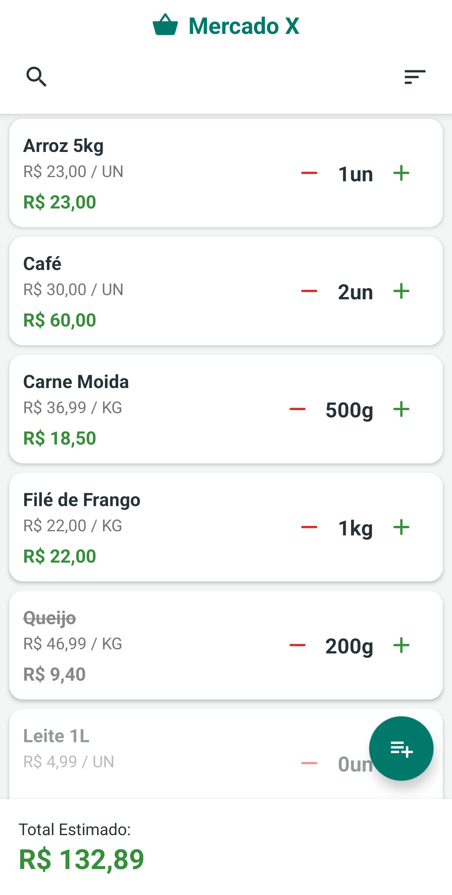
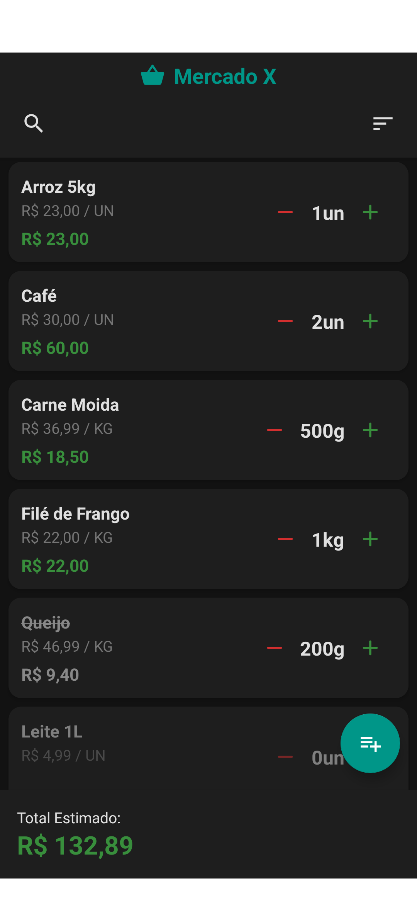
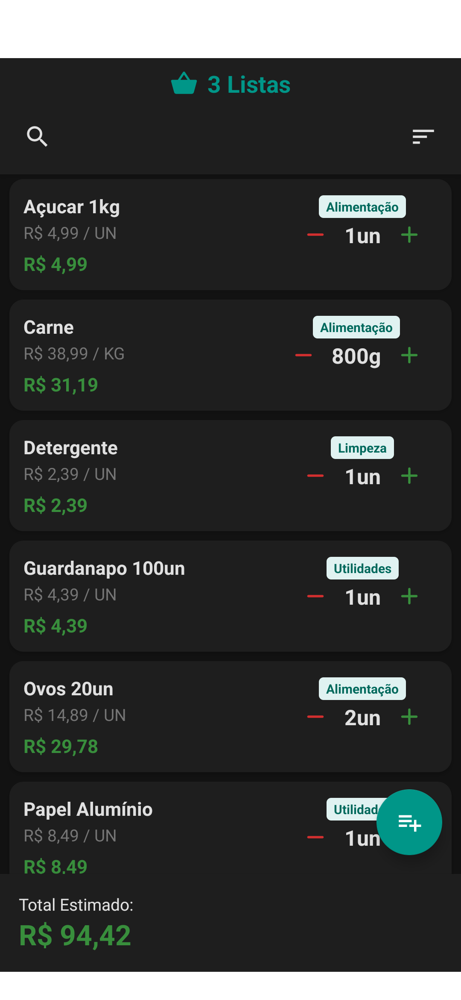
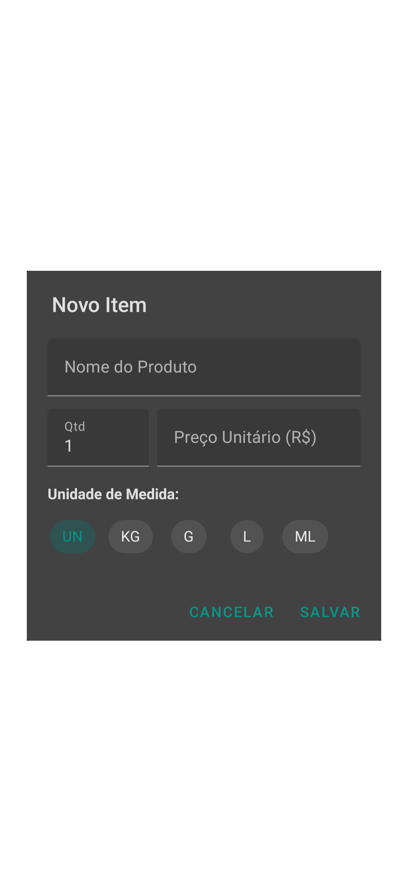
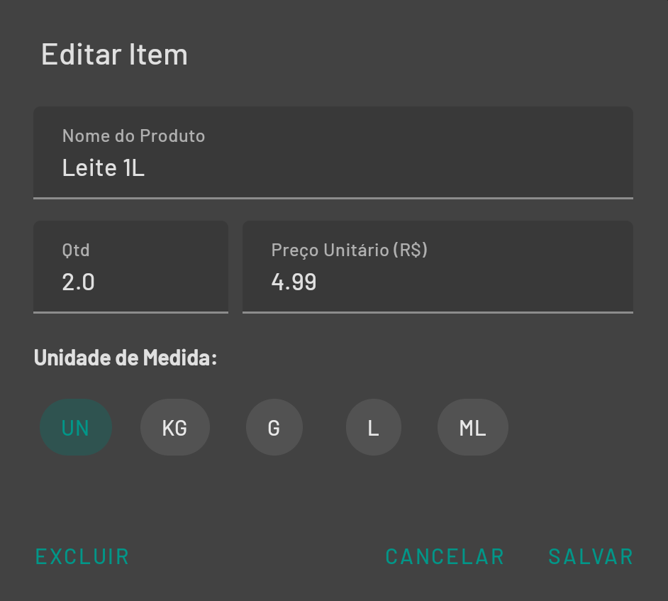

# ComprasApp 🛒

Um aplicativo Android simples para gerenciar listas de compras, desenvolvido em Kotlin. O foco é oferecer uma interface limpa e cálculo automático de gastos para o uso prático no dia a dia.

---

## 📱 Galeria das Funcionalidades

### 1. Temas
O aplicativo usa o tema do seu dispositivo.

<table>
  <tr>
    <td align="center" width="50%">
      
       
      Tema Claro
    </td>
    <td align="center" width="50%">
      
       
      Tema Escuro
    </td>
  </tr>
</table>

### 2. Organização de Múltiplas Listas
Gerencie listas separadas (Mercado, Farmácia, Alimentação) ou veja tudo junto.

<table>
  <tr>
    <td align="center" width="50%">
      
       
      Gerenciamento de Listas
    </td>
    <td align="center" width="50%">
      
       
      Visualização Múltipla de Listas
    </td>
  </tr>
</table>

### 3. Edição e Detalhes
Interface simples para adicionar e editar produtos com suporte a unidades variadas.

<table>
  <tr>
    <td align="center" width="50%">
      
       
      Novo Item
    </td>
    <td align="center" width="50%">
      
       
      Editar Item
    </td>
  </tr>
</table>

---

## ✨ Funcionalidades

### 🛒 Gerenciamento de Compras
* **Listas Infinitas:** Crie listas para diferentes contextos.
* **Visualização Híbrida:** Selecione múltiplas listas para ver todos os itens em uma única tela. Itens de listas diferentes ganham uma **etiqueta de identificação**.
* **Ordenação Automática:**
  * Itens pendentes ficam no topo.
  * Itens marcados (comprados) descem e ficam riscados.
  * Itens com quantidade zero (histórico) ficam no final.

### 🧮 Cálculos e Unidades
* **Total em Tempo Real:** Soma apenas os itens ativos na tela.
* **Unidades Dinâmicas:** Suporte para `UN`, `KG`, `G`, `L`, `ML`.
* **Formatação Automática:** Se digitar `0.5` em `KG`, o app exibe visualmente **500g**.

### 👆 Usabilidade
* **Ajuste Fino:**
  * *Clique Rápido (+/-):* Soma números inteiros.
  * *Clique Longo (+/-):* Ajuste decimal (0.1) para pesos exatos.
* **Busca Global:** Filtra itens em todas as listas ativas.
* **Modo Escuro:** Totalmente integrado ao sistema Android.

---

## 🛠 Tecnologias Usadas

O projeto foi desenvolvido seguindo as melhores práticas do **Android Jetpack**:

* **Linguagem:** Kotlin
* **Arquitetura:** MVVM (Model-View-ViewModel)
* **Banco de Dados:** Room (SQLite) com relacionamentos 1:N (Listas -> Itens).
* **Interface:** XML com ViewBinding e Material Design Components.
* **Assincronismo:** Kotlin Coroutines e Flow.
* **Componentes:** ViewModel, LiveData, RecyclerView (ListAdapter + DiffUtil).

---

*Desenvolvido por Lucas Dias Franco Pereira*
