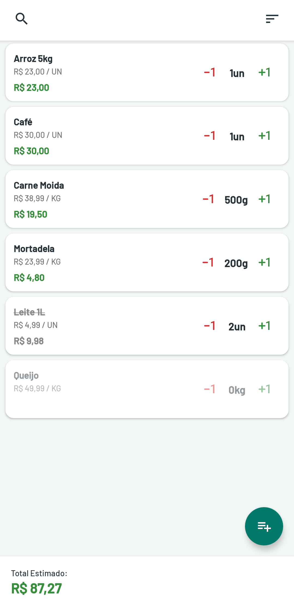
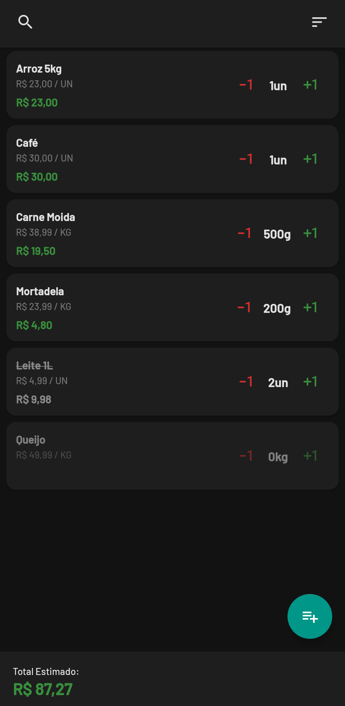

# ComprasApp 🛒

Um aplicativo Android simples para gerenciar listas de compras, desenvolvido em Kotlin. O foco é oferecer uma interface limpa e cálculo automático de gastos para o uso prático no dia a dia.

## 📱 Telas do App

### 🌓 Modos de Visualização
O aplicativo usa o tema do seu dispositivo.

<table>
  <tr>
    <td align="center">
      
       
      Tema Claro
    </td>
    <td align="center">
      
       
      Tema Escuro
    </td>
  </tr>
</table>

### 📝 Gerenciamento de Itens
Interface simples para adicionar e editar produtos com suporte a unidades variadas.

<table>
  <tr>
    <td align="center">
      
       
      Adicionar Novo Item
    </td>
    <td align="center">
      
       
      Editar Item
    </td>
  </tr>
</table>

## ✨ Funcionalidades

* **Gerenciamento de Itens:** Adicionar, editar e remover itens da lista.
* **Cálculo Automático:** Soma o valor total estimado da compra em tempo real.
* **Unidades Inteligentes:** Suporte para UN, KG, G, L e ML. O app formata automaticamente (ex: 0.5 KG vira 500g).
* **Organização Automática:**
    * Itens pendentes ficam no topo.
    * Itens marcados (comprados) descem e ficam riscados.
    * Itens com quantidade zero (histórico) ficam no final.
* **Modo Escuro:** Suporte automático a tema Claro/Escuro.
* **Ajuste Fino:**
    * Clique rápido nos botões `+` / `-`: Altera quantidades inteiras.
    * Clique longo: Ajuste fino decimal (0.1).
* **Busca:** Filtre itens pelo nome rapidamente.

## 🛠 Tecnologias Usadas

* **Linguagem:** Kotlin
* **Arquitetura:** MVVM (Model-View-ViewModel)
* **Banco de Dados:** Room (SQLite) para salvar os dados localmente.
* **Interface:** XML com ViewBinding.
* **Assincronismo:** Coroutines e Flow.
* **Componentes:** ViewModel, LiveData, RecyclerView (ListAdapter + DiffUtil).
